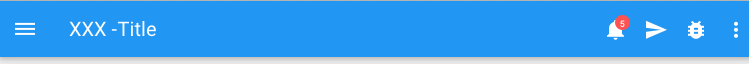

# Pip.WebUI Navigation Controls

Navigation controls UI components is a sub-module of Pip.Services platform and can be used in applications
based on the platform.

These controls are used to navigate through an application.

This module provides next functionality:

* Side navigation bar
* Application bar
* Navigation tabs control (Nav bar for Tablets and Desktops)
* Navigation dropdown control (Nav bar for Phones)

In the version 1.0.0 the implementation was cleaned up and covered with unit tests.
Implementation became fully portable across browser and devices.

[API reference](http://link.com)

### The complete library

* [https://github.com/pip-webui/pip-webui](https://github.com/pip-webui/pip-webui)

## Demos

[Examples Online](http://webui.pipdevs.com/pip-webui-nav/index.html)


## Quick links

* [Module dependencies](#dependencies)
* [Components](#components)
  - [Side navigation](#side_nav_bar)
  - [Application bar](#app_bar)
  - [Navigation tabs control](#tabs)
  - [Dropdown control](#dropdown)
* [Browsers compatibility](#compatibility)
* [Community](#community)
* [Contributing](#contributing)
* [Build](#build)
* [License](#license)


## <a name="dependencies"></a>Module dependencies

* <a href="https://github.com/pip-webui/pip-webui-tasks">pip-webui-tasks</a> - Helpful tasks for development
* <a href="https://github.com/pip-webui/pip-webui-lib">pip-webui-lib</a> - Vendor libraries
* <a href="https://github.com/pip-webui/pip-webui-css">pip-webui-css</a> - CSS Framework
* <a href="https://github.com/pip-webui/pip-webui-core">pip-webui-core</a> - Core platform module


## <a name="components"></a>Module components

### <a name="side_nav_bar"></a>Side navigation bar
<a href="doc/images/img-side-nav.png" style="border: 3px ridge #c8d2df; display: block">
    
</a>

Side navigation is located on the left of a screen. It fills a whole screen height. There are several sections which can
be grouped as need. Navigation items can have icon before text. At the top there is located user avatar.

Side navigation bar [API reference](http://link.com)

[Online Example](http://webui.pipdevs.com/pip-webui-nav/sidenav/index.html)

<br/>

### <a name="app_bar"></a>Application bar
<a href="doc/images/img-app-bar.png" style="border: 3px ridge #c8d2df; margin: 0 auto; display: inline-block">
    
</a>

Application bar is located on the top of page and contains many controls. It includes:
* burger side navigation button
* Plain title text or breadcrumbs
* notification icons
* some local actions
* any icons
* right submenu (usual there is signout button)

This component is responsive and stretched on a whole screen width.


Single document layout [API reference](http://link.com)

[Online Example](http://webui.pipdevs.com/pip-webui-nav/appbar/index.html)

<br/>

### <a name="tabs"></a>Navigation tabs control
<a href="doc/images/img-tabs.png" style="border: 3px ridge #c8d2df; margin: 0 auto; display: inline-block">
    
</a>

Tabs are navigation elements to another states. They are located on the bottom of application navigation bar.

If tabs are not fit into available space on different sides appear navigation arrows. On mobile screen tabs are transformed
into dropdown menu.

Tabs control [API reference](http://link.com)

[Online Example](http://webui.pipdevs.com/pip-webui-nav/nav_controls/index.html#/tabs)

<br/>

### <a name="dropdown"></a>Dropdown control
<a href="doc/images/img-dropdown.png" style="border: 3px ridge #c8d2df; margin: 0 auto; display: inline-block">
    
</a>

This control styled list which appears after click on source field. Dropped list is styled due to chosen theme.

Dropdown control [API reference](http://link.com)

[Online Example](http://webui.pipdevs.com/pip-webui-nav/nav_controls/index.html#/dropdown)


## <a name="compatibility"></a>Compatibility

PIP.WEBUI has been thoroughly tested against all major browsers and supports:

 * IE11+,
 * Edge
 * Chrome 47+,
 * Firefox 43
 * Opera 35

## <a name="community"></a>Community

* Follow [@pip.webui on Twitter](http://link.com)
* Subscribe to the [PIP.WebUI Newsletter](http://link.com)
* Have a question that's not a feature request or bug report? Discuss on the [PIP Forum](https://groups.google.com/forum/#!forum/pipdevs)
* Have a feature request or find a bug? [Submit an issue](http://link.com)
* Join our Community Slack Group! [PIP Worldwide](http://link.com)


## <a name="contributing"></a>Contributing

Developers interested in contributing should read the following guidelines:

* [Issue Guidelines](http://somelink.com)
* [Contributing Guidelines](http://somelink.com)
* [Coding guidelines](http://somelink.com)

> Please do **not** ask general questions in an issue. Issues are only to report bugs, request
  enhancements, or request new features. For general questions and discussions, use the
  [Pip Devs Forum](https://groups.google.com/forum/#!forum/pipdevs).

It is important to note that for each release, the [ChangeLog](CHANGELOG.md) is a resource that will
itemize all:

- Bug Fixes
- New Features
- Breaking Changes

## <a name="build"></a>Build

Projects environment deploy is occurred using npm and gulp.

First install or update your local project's **npm** tools:

```bash
# First install all the NPM tools:
npm install

# Or update
npm update
```

Then run the **gulp** tasks:

```bash
# To clean '/build' and '/dist' directories
gulp clean

# To build distribution files in the `/dist` directory
gulp build

# To launch samples (build will open samples/index page in web browser)
gulp launch
```

For more details on how the build process works and additional commands (available for testing and
debugging) developers should read the [Build Instructions](docs/guides/BUILD.md).


## <a name="license"></a>License

PIP.WebUI is under [MIT licensed](LICENSE).

