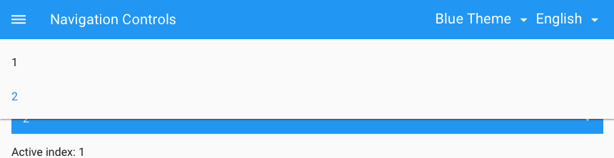

#  <br/> Navigation controls


Good navigation in complex Line-of-Business applications is absoletely critical. It shall allow users to jump from one page to another and access features quickly and freely. Cumbersome navigation, unintuitive links and lots of clicks can ruin any application. Ease of use and productivity of users in the first place depend on it. Pip.WebUI.Nav module provides controls for global and local navigation.

### Side navigation panel

Navigation **Sidenav* provided by this module is defined by configuration and does not require HTML markup. It shows navigation links with optional icons that can be combined into groups. The top of the **Sidenav** may contain information about the user or application.

```javascript
pipSideNavProvider.sections([
    {
        links: [
            {title: 'About', url: '/about?party_id=:party_id'},
            {title: 'Notes', url: '/notes?party_id=:party_id', access: accessOwner},
            {title: 'Big Picture', icon: 'icons:goal', url: '/unfinished?party_id=:party_id'},
            {title: 'Timeline', icon: 'icons:film', url: '/ultimate_todo?party_id=:party_id'}
        ]
    },
    {
        title: 'Get',
        access: accessContributor,
        links: [
             {title: 'Goals', url: '/goals?party_id=:party_id'},
        ]
    },
    {
        links: [
            {title: 'Search', url: '/search?party_id=:party_id', access: accessManager}
        ]
    }
]);
```

<a href="doc/images/img-side-nav.png" style="border: 3px ridge #c8d2df; display: block">
    
</a>

### Application bar

**Appbar** similar to **Sidenav** has a complex structure that if defined by configuration. It contains menu icon, title that can be turned into breadcrumb, primary actions on the bar and secondary actions hidden in popup menu.

<a href="doc/images/img-app-bar.png" style="border: 3px ridge #c8d2df; margin: 0 auto; display: inline-block">
    
</a>

### Navigation tabs

**Navigation tabs** are similar to regular tabs. But they contain links and turn into **Navigation dropdown** on smaller screens.

<a href="doc/images/img-tabs.png" style="border: 3px ridge #c8d2df; margin: 0 auto; display: inline-block">
    
</a>

### Navigation dropdown

**Navigation dropdown** control is places at the top of the page, properly styled and contains navigation links

<a href="doc/images/img-dropdown.png" style="border: 3px ridge #c8d2df; margin: 0 auto; display: inline-block">
    
</a>


## Learn more about the module

- [User's guide](doc/UsersGuide.md)
- [Online samples](http://webui.pipdevs.com/pip-webui-nav/index.html)
- [API reference](http://webui-api.pipdevs.com/pip-webui-nav/index.html)
- [Developer's guide](doc/DevelopersGuide.md)
- [Changelog](CHANGELOG.md)
- [Pip.WebUI project website](http://www.pipwebui.org)
- [Pip.WebUI project wiki](https://github.com/pip-webui/pip-webui/wiki)
- [Pip.WebUI discussion forum](https://groups.google.com/forum/#!forum/pip-webui)
- [Pip.WebUI team blog](https://pip-webui.blogspot.com/)

## <a name="dependencies"></a>Module dependencies

* [pip-webui-lib](https://github.com/pip-webui/pip-webui-lib): angular, angular material and other 3rd party libraries
* [pip-webui-css](https://github.com/pip-webui/pip-webui-css): CSS styles and web components
* [pip-webui-core](https://github.com/pip-webui/pip-webui-core): localization and other core services

## <a name="license"></a>License

This module is released under [MIT license](License) and totally free for commercial and non-commercial use.
