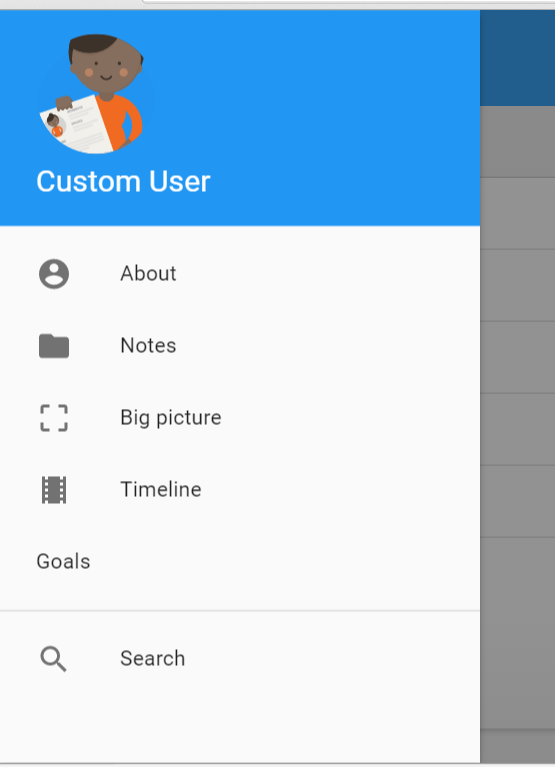
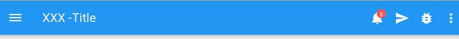
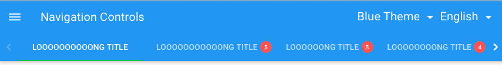

# Pip.WebUI.Nav User's Guide

## <a name="contents"></a> Contents
- [Installing](#install)
- [pipSidenav provider](#sidenav_provider)
- [pip-sidenav directive](#sidenav)
- [pipAppbar provider](#appbar_provider)
- [pip-appbar directive](#appbar)
- [pip-tabs directive](#tabs)
- [pip-dropdown directive](#dropdown)
- [Questions and bugs](#issues)


## <a name="install"></a> Installing

Add dependency to **pip-webui** into your **bower.json** or **package.json** file depending what you use.
```javascript
"dependencies": {
  ...
  "pip-webui": "*"
  ...
}
```

Alternatively you can install **pip-webui** manually using **bower**:
```bash
bower install pip-webui
```

or install it using **npm**:
```bash
npm install pip-webui
```

Include **pip-webui** files into your web application.
```html
<link rel="stylesheet" href=".../pip-webui-lib.min.css"/>
<link rel="stylesheet" href=".../pip-webui.min.css"/>
...
<script src=".../pip-webui-lib.min.js"></script>
<script src=".../pip-webui.min.js"></script>
```

Register **pipNav** module in angular module dependencies.
```javascript
angular.module('myApp',[..., 'pipNav']);
```

## <a name="sidenav_provider"></a> pipSidenav provider

**pipSidenav** provider allows to configure **pip-sidenav** during configure and run phases. 
The configuration includes user or application info and naviation links.

### Usage
```javascript
pipSideNavProvider.sections([
    {
        links: [
            {
                title: 'Dashboard', url: '/dashboard?party_id=:party_id', access: function () {
                    // return any_conditions;
                }
            },
            {title: 'About', url: '/about?party_id=:party_id'}
        ]
    },
    {
        title: 'Get',
        access: function () {
            // return any_conditions;
        },
        links: [
            {title: 'Incoming', icon: 'icons:folder', url: '/ideas?party_id=:party_id'},
            {title: 'Big Picture', icon: 'icons:goal', url: '/unfinished?party_id=:party_id'},
            {title: 'Events', icon: 'icons:star', url: '/ultimate_todo?party_id=:party_id'}
        ]
    },
    {
        links: [
            {title: 'Help', url: '/help'},
            {title: 'Support', url: '/support?party_id=:user_id'},
            {title: 'Settings', url: '/settings?party_id=:party_id'}
        ]
    }
]);
```

### Methods

* **theme(theme: string): string** - gets or sets color theme
  - Params:
    + theme - name of color theme or **null** to make no changes
  - Returns: the currently set name of color theme

* **avatarUrl(url: string): string** - gets or sets url of avatar displayed in the sidenav header
  - Params:
    + url - image url or **null** to make no changes
  - Returns: the currently set image url

* **title(text: string): string** - gets or sets title on the sidenav header
  - Params:
    text - text to be written on the title or **null** to make no changes
  - Returns: the currently set title text

* **subTitle(text: string): string** - gets or sets subtitle on the sidenav header
  - Params:
    text - text to be written on the subtitle or **null** to make no changes
  - Returns: the currently set subtitle text

* **sections(sections: any): any** - gets or sets configuration or navigation sections
  - Params:
    + sections - sections configuration or **null** to make no changes
  - Returns: the current configuration of navigation sections
  - 
* **open(): void** - opens sidenav
* **close(): void** - closes sidenav
* **toggle(): void** - toggles sidenav open/close state
  
### Sections Configuration object
* **title** - title on the sidenav section
* **access** - function, which will show or hide section depending on the conditions specified inside
* **links** - array of links in current section
    + title - title of the link
    + icon - icon of the link
    + url - link url, which will set $location.url() after click link
    + access - function, which will show or hide link depending on the conditions specified inside
    + href - link href, which will set to $window.location.href after click link
    + state - link state, in which will navigate by function $state.go() after click link

## <a name="sidenav"></a> pip-sidenav directive

**pip-sidenav** directive inserts into HTML markup the navigation Sidenav panel. It presents information, configured in **pipSidenav** provider.

### Usage
```html
<pip-sidenav></pip-sidenav>
```



## <a name="appbar_provider"></a> pipAppbar provider

**pipAppbar** provider allows to configure **pip-appbar** during configure and run phases. 
The configuration includes title and breadcrumb text, primary and secondary actions.

### Usage
```javascript
// In config:
pipAppBarProvider.globalActions(
    [
        {
            name: 'sample.notifications', tooltip: 'Notifications',
            event: 'pipNotificationsClicked', count: 0,
            icon: 'icons:bell'
        }
    ],
    [
        {name: 'sample.settings', title: 'Settings'},
        {name: 'sample.signout', title: 'Signout'}
    ]
);

//Or in controller:

// Show menu navigation icon
pipAppBar.showMenuNavIcon();
// Show title in appbar
pipAppBar.showTitleText('Application name');
// Show breadcrumbs in appbar
pipAppBar.showTitleBreadcrumb([
    {title: 'Header'},
    {title: 'SubHeader'},
    {title: 'Application name'}
]);
```

### pipAppbarProvider methods
* **appTitleText(title: string) : string** - sets and gets title of appbar
    - Params:
        title - text to be written on the title or **null** to make no changes
    - Returns: the currently set title text
    
* **appTitleLogo(path: string) : string** - sets and gets logo of appbar
    - Params:
        + path - path to application logo
    - Returns: the currently set logo path
    
* **theme(theme: string) : string** - sets and gets theme of appbar
    - Params:
        + theme - name of color theme or **null** to make no changes
    - Returns: the currently set name of color theme
    
* **globalActions(primaryActions : array, secondaryActions : array) : void** - sets global actions of appbar
    - Params:
        + primaryActions - array of global primary actions
        + secondaryActions - array of global secondary actions
        
* **globalPrimaryActions(primaryActions : array) : void** - sets global primary actions
    - Params:
        + primaryActions - array of global primary actions
        
* **globalSecondaryActions(secondaryActions : array) : void** - sets global secondary actions
    - Params:
        + secondaryActions - array of global secondary actions
        
### pipAppbar methods
* **getConfig() : object** - gets configurations of appbar
    - Returns: the currently set configuration object
    
* **cssClass(newCssClass : string) : string ** - sets or gets css class of appbar
    - Params:
        + newCssClass - css class of appbar
    - Returns: the currently set class of appbar
    
* **hideNavIcon() : void** - hide navigation icon on appbar
* **showMenuNavIcon(click: function) : void** - show menu navigation icon on appbar
    - Params:
        + click - function, which is performed after clicking
        
* **showBackNavIcon(click: function) : void** - show back navigation icon on appbar
    - Params:
        + click - function, which is performed after clicking
        
* **showAppTitleLogo() : void** - shows application logo of appbar
* **showAppTitleText() : void** - shows application title of appbar
* **showTitleLogo(titleLogo: string) : void** - sets and shows logo of appbar
    - Params:
        + titleLogo - path to application logo
        
* **showTitleText(titleText: string) : void** - sets and shows title of appbar
    - Params:
        + titleText - text to be written on the title or **null** to make no changes
        
* **showTitleBreadcrumb(titleText: string, titleBreadcrumb: string array) - sets and shows breadcrumbs on appbar
    - Params:
        + titleText - text to be written on the title or **null** to make no changes
        + titleBreadcrumb - array of strings with links to special states
        
* **hideTitle() : void** - hides any titles of appbar

* **showLanguage(languages: string array) : void** - sets languages and shows dropdown with languages on appbar
    - Params:
        + languages - array of languages
        
* **showLocalActions(primaryActions: array, secondaryActions: array) : void** - sets and shows local actions
    - Params:
        + primaryActions - array of local primary actions
        + secondaryActions - array of local secondary actions
        
* **hideLocalActions() : void** - hides local actions

* **updateActionCount(actionName: string, count: number) : void** - sets counts for special action in appbar
    - Params:
        + actionName - name of action, to which is necessary to assign a counts
        + count - number, which will assign to special action
        
* **showSearch(callback: function, criteria: string, history: string array) : void** - sets and shows search block on appbar
    - Params:
        + callback - function, which is called after clicking on search
        + criteria - string, which is the search criterion
        + history - string array, which contains last search criteria
        
* **hideSearch() : void** - hides search block from appbar

* **updateSearchCriteria(criteria: string) : void** - sets search criteria
    - Params:
        + criteria - string, which is the search criterion
        
* **updateSearchHistory(history: string array)** - sets search history
    - Params:
        + history - string array, which contains last search criteria
        
* **showShadow() : void** - shows shadow of appbar

* **showShadowSm() : void** - shows shadow on screens < 1200px and > 679px in width

* **showShadowSmXs() : void** - shows shadow on screens < 1200px in width

* **hideShadow() : void** - hides shadow of appbar

### Action configuration object
* **name** - name of action, which identify current action
* **tooltip** - string, which will disappear under action on hover
* **event** - event, which will broadcast after clicking action
* **count** - number that appears near action icon
* **icon** - icon that appears inside the action button

## <a name="appbar"></a> pip-appbar directive

**pip-appbar** directive inserts into HTML markup the navigation Appbar panel. It has a complex structure that includes:
- Menu icon that can be shown as avatar or logo
- Application title
- Breadcrumb that can replace the title
- Primary actions visualized we icons
- Secondary actions places into popup menu under three dots on the right
- Integrated search bar with history

Primary and secondary actions are divided into global, that are set once during configure phase, and local, that are changed in runtime by every page.

### Usage
```html
<pip-appbar pip-title="title" 
            pip-show-menu="true"
            pip-global-actions="globalActions"
            pip-local-actions="localActions">
</pip-appbar>
```

Todo: Add screenshots with breadcrumb, secondary actions and search bar


### Attributes
* **pip-title** - sets title of appbar
* **pip-show-menu** - shows or hides menu in appbar. Values: **true** or **false**
* **pip-global-actions** - sets global actions of appbar
* **pip-local-actions** - sets local actions of appbar

## <a name="tabs"></a> pip-tabs directive

Navigation tabs control. Besides other small modifications it provides responsive capabilities. To improve usability on smaller screens it turns into **pip-dropdown**.

### Usage
```html
<pip-tabs pip-tabs="tabs" pip-active-index="tabIndex"
          pip-show-tabs="showTabs" pip-tabs-shadow="showShadow" pip-tabs-select="onSelect"
          ng-disabled="disabled">
</pip-tabs>
```

Todo: Add similar image with dropdown on small screen


### Attributes
* **pip-tabs** - list of tabs
* **pip-active-index** - sets and gets index of currently choose tab
* **pip-show-tabs** - shows and hides tabs. Value: **true** or **false**
* **pip-tabs-shadow** - shows or hides tabs shadow
* **pip-tabs-select** - a function that is called after selecting the tab
* **ng-disabled** - disable tabs control. Value: **true** or **false**

## <a name="dropdown"></a> pip-dropdown directive

Navigation dropdown control is similar to popup but it looks and behaves slightly different. It is styled to be seemlessly integrated into application title. It resizes itself to entire available width and can go down to the bottom of the screen. If list takes more space then the screen height, the drop down is smart enough to scroll it while standard popup doesn't do that.

### Usage
```html
<pip-dropdown pip-actions="actions" pip-active-index="activeIndex"
              ng-disabled="disabled" pip-show="showDropdown"
              pip-dropdown-select="onSelect">
</pip-dropdown>
```

Todo: Add similar image with dropdown on small screen


### Attributes
Todo: Describe the directive attributes here
* **pip-actions** - list of actions
* **pip-active-index** - sets and gets index of currently choose action
* **pip-show** - shows and hides dropdown. Value: **true** or **false**
* **pip-dropdown-select** - a function that is called after selecting the action
* **ng-disabled** - disable tabs control. Value: **true** or **false**

## <a name="issues"></a> Questions and bugs

If you have any questions regarding the module, you can ask them using our 
[discussion forum](https://groups.google.com/forum/#!forum/pip-webui).

Bugs related to this module can be reported using [github issues](https://github.com/pip-webui/pip-webui-nav/issues).
